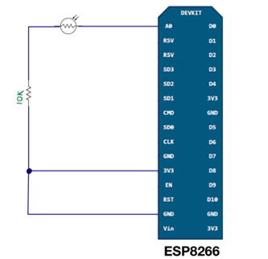
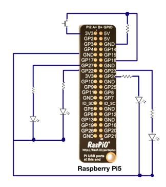
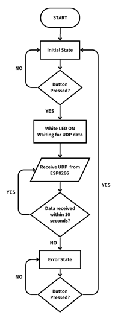
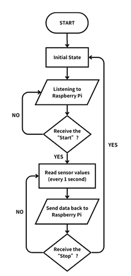

# IoT Light Sensing Project

## Table of Contents
1. [Components](#components)
2. [System Overview](#system-overview)
3. [Hardware Setup](#hardware-setup)
   - [ESP8266 Setup](#esp8266-setup)
   - [Raspberry Pi Setup](#raspberry-pi-setup)
4. [Communication Protocol](#communication-protocol)
5. [Main Functionality](#main-functionality)
6. [System Flow](#system-flow)
   - [Raspberry Pi Flow](#raspberry-pi-flow)
   - [ESP8266 Flow](#esp8266-flow)
7. [Demo](#demo)

## Components
- Raspberry Pi
- ESP8266
- Photoresistor (Light Sensor)
- LEDs (Red, Yellow, Green, and White)
- Buttons (Start/Reset, UDP Packet Loss Simulation)

## System Overview
This IoT project uses a Raspberry Pi and an ESP8266 to monitor light levels using a photoresistor. The ESP8266 collects data and sends it to the Raspberry Pi, which then displays the light level using LEDs.

## Hardware Setup

### ESP8266 Setup
1. **Photoresistor (Analog Light Sensor):**
   - One side: Connected to 3.3V
   - Other side: Connected to A0 (analog input) on the ESP8266
   - Use a 10kΩ pull-down resistor between the photoresistor and ground

2. **Onboard LED:** No extra connections needed (controlled via code)

### Raspberry Pi Setup
1. **LEDs:** All LEDs use a 330Ω resistor between the GPIO pin and LED anode
   - Red LED: GPIO 27
   - Yellow LED: GPIO 22
   - Green LED: GPIO 23
   - White LED: GPIO 24

2. **Button:**
   - Connected to GPIO 15
   - Other leg connected to GND (pin 6)
   - 10kΩ pull-down resistor between the button and GND

## Communication Protocol
- Uses UDP for communication between Raspberry Pi and ESP8266
- Raspberry Pi IP: 192.168.1.xxx
- ESP8266 IP: 192.168.1.xxx

### UDP Message Flow & Data Transmission
1. **Start Communication:**
   - Raspberry Pi → ESP8266: "START"
   - ESP8266 → Raspberry Pi: "DATA: <average_value>" (every 2 seconds)

2. **Error Handling:**
   - If no response from ESP8266 for 10 seconds:
     - White LED flashes every 0.5 seconds
     - Button press required to reset and re-establish communication

3. **Stop Communication:**
   - Raspberry Pi → ESP8266: "STOP"
   - ESP8266 halts data collection and turns off its onboard LED

## Main Functionality
1. **Initialization:** Button press on Raspberry Pi activates white LED and starts communication
2. **ESP8266 Response:** Flashes LED, collects data, sends average light sensor value every 2 seconds
3. **Raspberry Pi Reaction:** Controls RGB LEDs based on received light value (LOW, MEDIUM, HIGH)
4. **Error Handling:** White LED flashes if no data received for 10 seconds
5. **Reset:** Button press stops data collection and resets both devices

## System Flow

### Raspberry Pi Flow

### ESP8266 Flow

## Demo
[View Demo Video](https://drive.google.com/file/d/1eb1Ryeq-JZTNZIdM9p7p94Wu8D1bjBXA/view?usp=drive_link](https://drive.google.com/file/d/1iB5b1A3w3z4M8ymoQmxHrwyPXidl_wKg/view?usp=drive_link)
